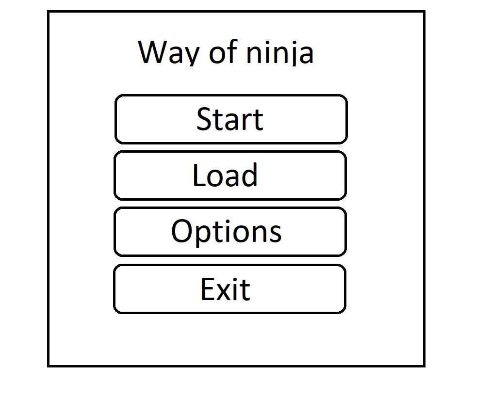
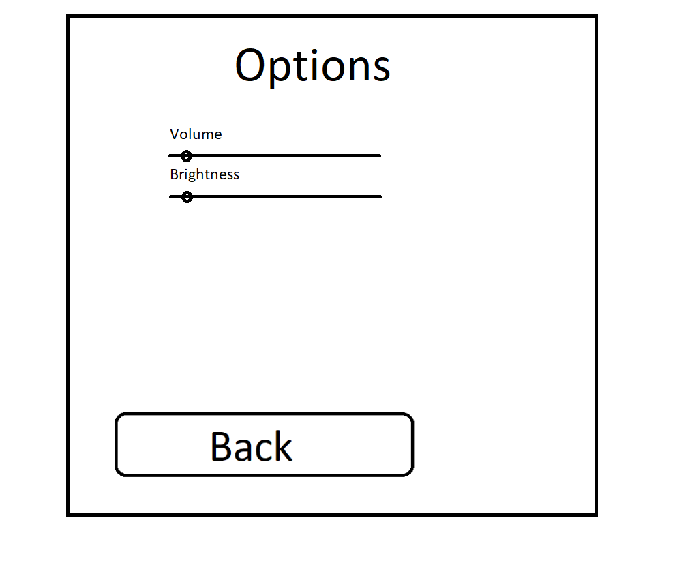
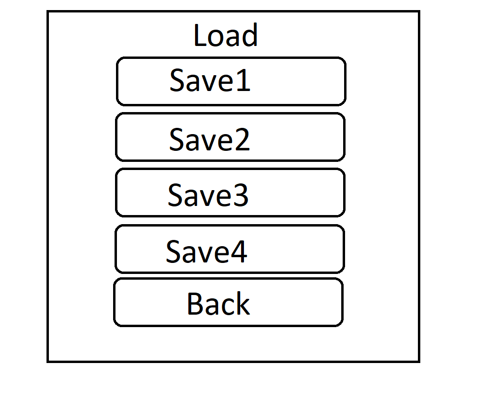

# Требования к проекту
## 1 Введение
### 1.1 Назначение.
  Проект будет представлять собой игру-платформер "Path of the ninja". Игрок юудет управлять своим персонажем при помощи клавиатуры и мыши. В игре будет реализована денежная система. Игрок будет получать монеты, путем их сбора на уровнях, а также убийств врагов и боссов. Монеты дают дополнительные очки после прохождении уровня. В проект будет интегрированна реклама, в связи с тем что проект является бесплатным, но для разработаки требуется монетизация. Так же возможно купить премиум версию игры для отключения рекламы.
### 1.2 Аналоги.
  * [Ori and the Will of the Wisps](https://www.orithegame.com/) 
  * [Cuphead](https://store.steampowered.com/app/268910/Cuphead/) 
## 2 Требования пользователя
### 2.1 Программные интерфейсы
  Игра будет реализована на Unity3D и языке C# под операционную систему Windows 10.
### 2.2 Интерфейс пользователя
  1) Главное меню игры.
  
  2) Меню настроек, где можно поменять громкость музыки и яркость.
  
  3) Меню сохранённых игр, где можно продолжыть игру с контрольной точки.
  
  4) Внутриигровой интерфейс.
  
### 2.3 Характеристики пользователей
  Всем группам пользователей будет предоставлен один и тот же функционал, за исключением того, что пользователи с премиум версией смогут пользоваться игрой без рекламной интеграции.
  Целевой аудиторией является любой человек владеющий компьютером на стандартном уровне и имеющий достаточно времени для игр.
## 3 Системные требования
### 3.1 Функциональные требования
* Возможность запускать игру и играть.
* Возможность изменять громкость звука и яркость изображения.
* Возможность загрузки игры с контрольной точки.
### 3.2 Нефункциональные требования
#### 3.2.1. Атрибуты качества
* При недостатке файлов пользователю будет выводится список недостающих или измененных файлов, которые необходимо заменить.
* Игра будет выполнять автосохранения на контрольных точках, для сохранения прогресса при непредвиденном выходе из программы.
